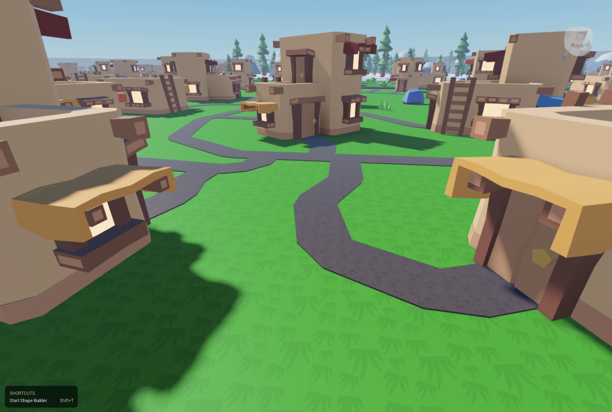

Welcome! This plugin was born while I was building a game world full of small houses. I wanted to lay winding paths from each front door to the main road, but Roblox’s own tools and available plugins made that slow and fiddly.

All I wanted was to pick a template part (with material and texture), then click here-here-here to sketch the route and end up with parts that are perfectly connected, no gaps, and no texture z-index fighting. So I spent the next two weeks building the first version. Click to Build exists to make that workflow fast, clean, and fun.

Now the plugin has grown to be more than that!

